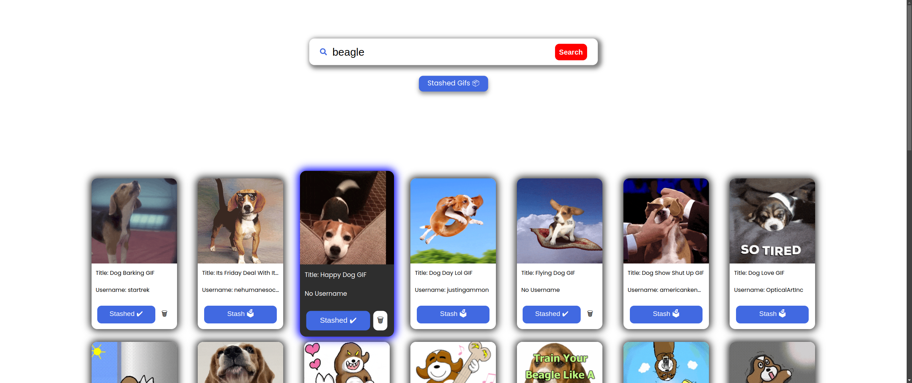
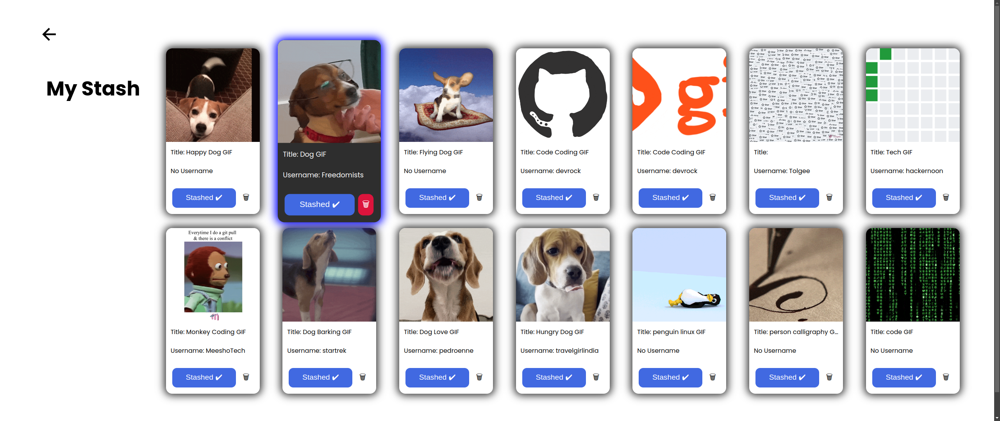

# Gif Haven
Search & stash gifs from GIPHY

# Instructions to run locally
Clone the repository & go into it:
```bash
git clone https://github.com/rexept/gif-haven
cd gif-haven
```

Create a .env file with VITE_GIPHY_API_KEY specified.\
Example for linux:
```bash
echo "VITE_GIPHY_API_KEY=XXXXXXXXXXXXXXXXX" >> .env
```
Run `npm install && npm run dev` and you're good to go!


# Screenshots


